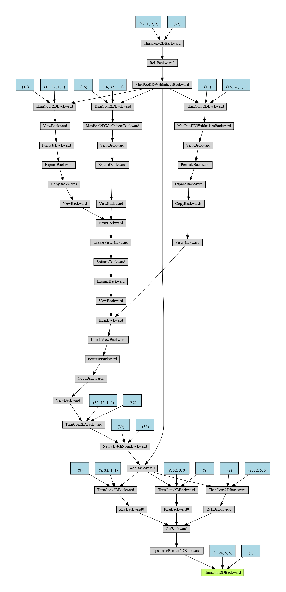

# SuperResolutionViaAttentionMechanism
This Japanese proceeding paper [Model Construction for Super Resolution by Using Attention Mechanism / 超解像のためのAttention機構を用いたモデルの構築](https://cir.nii.ac.jp/crid/1520572359887172736) has been accpeted by ISCIE the 65th Annual Conference of the Institute of Systemsm Control and Information Engineers / 第65回システム制御情報学会研究発表講演会 (ISCIE-SCI 2021).

### Citation
```
Bowen Zhang / 張伯聞, Masahiro Tanaka / 田中雅博, "Model Construction for Super Resolution by Using Attention Mechanism / 超解像のためのAttention機構を用いたモデルの構築," Proceedings of ISCIE the 65th Annual Conference of the Institute of Systemsm Control and Information Engineers / 第65回システム制御情報学会研究発表講演会, pp. 530-533, 2021.
```

In this work, we propose a convolutional neural network structure by adding soft-attention mechanism to be used for super resolution task, where the filters of different sizes in parallel are used to extract the multi-scale features. 


In the experimental results, we conduct some examples of comparing our method with the traditional interpolation method [Bicubic](https://www.jstor.org/stable/pdf/2157021.pdf) and a deep learning method [SRCNN](https://arxiv.org/pdf/1905.05373.pdf) with PSNR to demonstrate the usefulness of our model.


# Usage
### Dependencies 
```
python=3.6
cudatoolkit
torch
torchvision
Pillow
```

### Model


### Datasets
[BSDS500](https://www2.eecs.berkeley.edu/Research/Projects/CS/vision/grouping/resources.html)


### Train & test
```
train.py
```

### Demo
```
inference.py
```